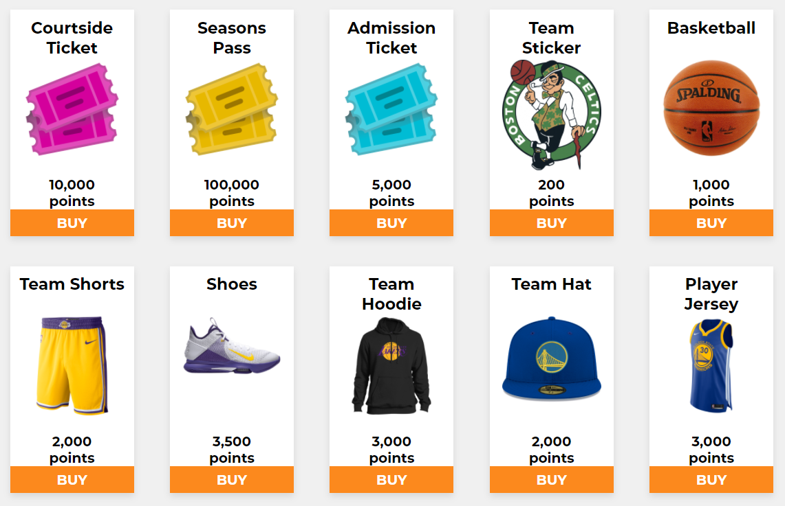

<!-- PROJECT SHIELDS -->
[![Contributors][contributors-shield]][contributors-url]
[![Forks][forks-shield]][forks-url]
[![Stargazers][stars-shield]][stars-url]
[![Issues][issues-shield]][issues-url]
[![LinkedIn][linkedin-shield]][linkedin-url]


<!-- PROJECT LOGO -->
<br />
<p align="center">
  <a href="https://github.com/RMcCurdy/Bandwagon">
    
  </a>

  <h3 align="center">Bandwagon</h3>

  <p align="center">
    Vote on NBA Games to earn points!
    <br />
    <a href="https://github.com/RMcCurdy/Bandwagon"><strong>Explore the docs »</strong></a>
    <br />
    <br />
    <!-- TODO Add a link to the working Bandwagon website for the Demo -->
    <a href="https://github.com/RMcCurdy/Bandwagon/issues">View Website</a>
    ·
    <a href="https://github.com/RMcCurdy/Bandwagon/issues">Report Bug</a>
    ·
    <a href="https://github.com/RMcCurdy/Bandwagon/issues">Request Feature</a>
  </p>
</p>


<!-- TABLE OF CONTENTS -->
<details open="open">
  <summary><h2 style="display: inline-block">Table of Contents</h2></summary>
  <ol>
    <li>
      <a href="#about-the-project">About The Project</a>
      <ul>
        <li><a href="#built-with">Built With</a></li>
      </ul>
    </li>
    <li>
      <a href="#getting-started">Getting Started</a>
      <ul>
        <li><a href="#installation">Installation</a></li>
        <li><a href="#launch">Launch</a></li>
      </ul>
    </li>
    <li><a href="#usage">Usage</a></li>
    <li><a href="#contact">Contact</a></li>
  </ol>
</details>


<!-- ABOUT THE PROJECT -->
## About The Project

Bandwagon is our web-based application using ASP.NET Core 5 backend API, Entity Framework Core, a SQLite backend database, and a React JS front end client. 

Users of the web app are able to create accounts and voice their opinions on who will win NBA games. We provide them with a prediction as insight, and with that they are able to vote. Points are awarded to the user if they voted correctly based on the win percentage of the team they chose.

<p align="left">
  
</p>

Points can be used in our shop to redeem a variety of prizes or merchandise.

<p align="left">
  
</p>

By participating on Bandwagon, badges are awarded to users based on certain criteria.

<p align="left">
  
</p>

A leaderboard is provided to see how other users stack up against them in terms of total points gained.

<p align="left">
  
</p>


With all of these utilities, we hope that Bandwagon can become a hub for NBA game predictions.

### Built With

* [React.js](https://reactjs.org/)
* [SQLite](https://www.sqlite.org/index.html)
* [ASP.NET Core 5](https://dotnet.microsoft.com/)
* [Entity Framework Core](https://docs.microsoft.com/en-us/ef/)
* [JavaScript](https://www.javascript.com/)
* [HTML](https://developer.mozilla.org/en-US/docs/Web/HTML)
* [CSS](https://developer.mozilla.org/en-US/docs/Web/CSS)


<!-- GETTING STARTED -->
## Getting Started

To get Bandwagon up and running follow these simple steps.


### Installation

1. Clone the repo
   ```sh
   git clone https://github.com/RMcCurdy/Bandwagon.git
   ```
2. Install NPM packages
   ```sh
   npm install
   ```

### Launch

1. Run the Database
   ```sh
   cd backend
   dotnet run
   ```
2. Run the React.js Frontend
   ```sh
   cd reactapp
   npm start
   ```

<!-- USAGE EXAMPLES -->
## Usage

Use this space to show useful examples of how a project can be used. Additional screenshots, code examples and demos work well in this space. You may also link to more resources.


<!-- CONTACT -->
## Contact

Robert McCurdy - [@robert-mccurdy](https://www.linkedin.com/in/robert-mccurdy/) - robertwmccurdy@gmail.com

Project Link: [https://github.com/RMcCurdy/Bandwagon](https://github.com/RMcCurdy/Bandwagon)


<!-- MARKDOWN LINKS & IMAGES -->
<!-- https://www.markdownguide.org/basic-syntax/#reference-style-links -->
[contributors-shield]: https://img.shields.io/github/contributors/RMcCurdy/Bandwagon.svg?style=for-the-badge
[contributors-url]: https://github.com/RMcCurdy/Bandwagon/graphs/contributors
[forks-shield]: https://img.shields.io/github/forks/RMcCurdy/Bandwagon.svg?style=for-the-badge
[forks-url]: https://github.com/RMcCurdy/Bandwagon/network/members
[stars-shield]: https://img.shields.io/github/stars/RMcCurdy/Bandwagon.svg?style=for-the-badge
[stars-url]: https://github.com/RMcCurdy/Bandwagon/stargazers
[issues-shield]: https://img.shields.io/github/issues/RMcCurdy/Bandwagon.svg?style=for-the-badge
[issues-url]: https://github.com/RMcCurdy/Bandwagon/issues
[linkedin-shield]: https://img.shields.io/badge/-LinkedIn-black.svg?style=for-the-badge&logo=linkedin&colorB=555
[linkedin-url]: https://linkedin.com/in/robert-mccurdy
